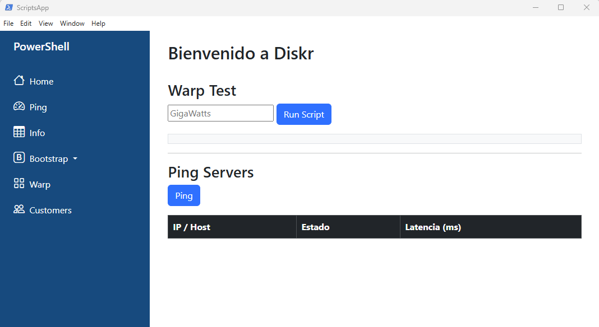
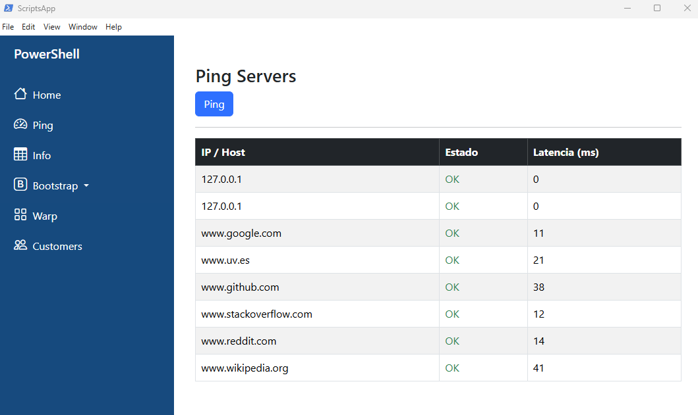
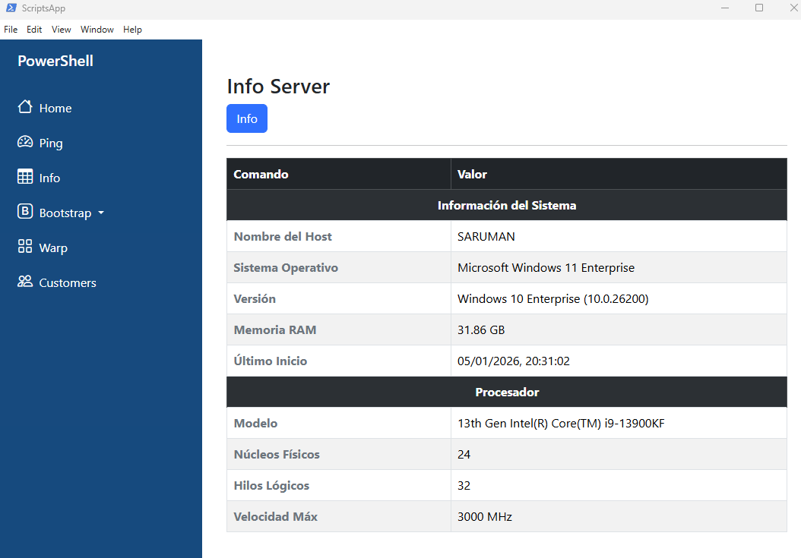

# Scripts PowerShell

**Scripts.**

> [!NOTE]
> PING

A basic Electron application contains:

- `package.json` - 
- `main.js` - S
- `index.html` - A 
- `preload.js` - A 
> INFO
## Install

```bash
# Clone this repository
git clone https://github.com/electron/minimal-repro
# Go into the repository
cd ScriptsApp
# Install dependencies
npm install
# Run the app
npm start
```

## USO






